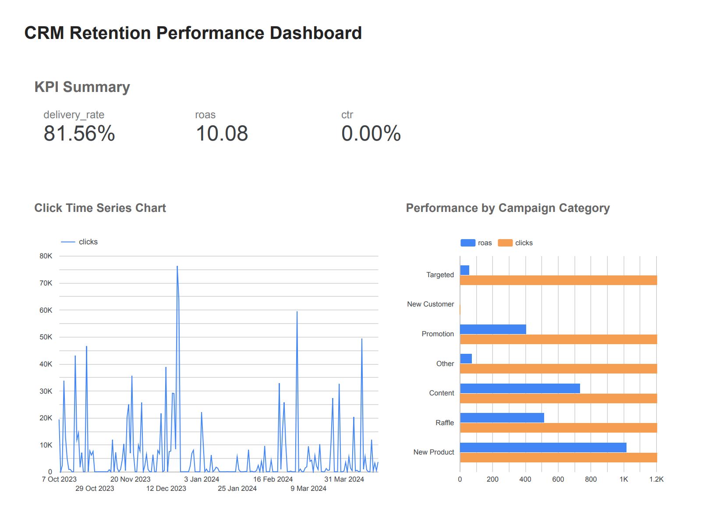

# crm-retention-performance-dashboard

---

## Project Objective

This project aims to:
- Monitor CRM performance KPIs across **KakaoTalk**, **Push**, and **IAM** channels
- Identify channel- or category-specific patterns in customer retention
- Provide actionable insights to improve **ROI** and **engagement rates**

---

## Key Metrics

| Metric           | Description                                    |
|------------------|------------------------------------------------|
| `delivery_rate`  | Proportion of messages successfully delivered  |
| `ctr`            | Click-Through Rate (clicks / impressions)      |
| `roas`           | Revenue Over Ad Spend                          |

---

## Tools Used

- **Excel**: Initial data review and manual tagging
- **Python (Pandas)**: Data cleaning, metric calculation
- **Looker Studio**: Interactive dashboard creation (Google Sheets as source)

---

## Highlights from Analysis

- **Push** campaigns consistently drove the highest CTR (esp. weekend campaigns)
- **KakaoTalk** yielded superior ROAS, especially in raffle-type promotions
- Campaigns sent on **Mondays** underperformed in both delivery and engagement

**Timing** and **channel mix** optimization could yield significant ROI improvements.

---

## Dashboard Snapshot (Looker Studio)

---

## Future Enhancements

- Integrate segmentation by user attributes (e.g., loyalty tier, purchase recency)
- Automate data ingestion via BigQuery or campaign platform API
